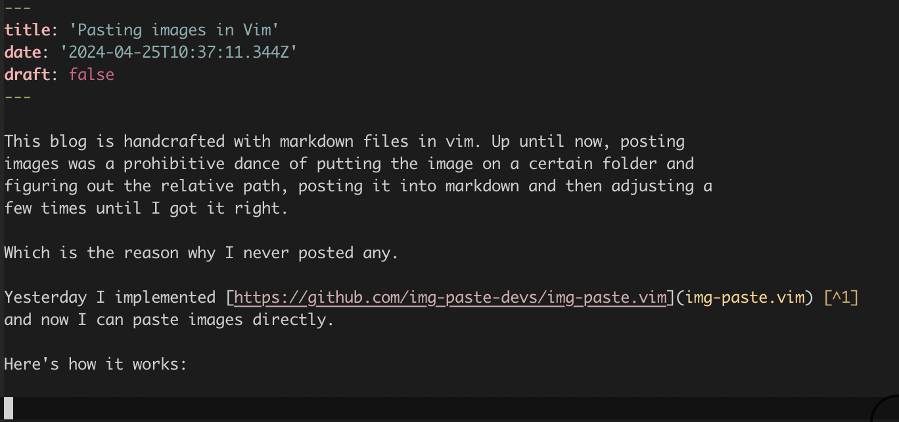

This blog is handcrafted with markdown files in vim. Up until now, posting
images was a prohibitive dance of putting the image on a certain folder and
figuring out the relative path, posting it into markdown and then adjusting a
few times until I got it right. 

Which is the reason why I never posted any.

Yesterday I implemented [https://github.com/img-paste-devs/img-paste.vim](img-paste.vim) [^1]
and now I can paste images directly. 

If you see the below image, it worked!





## Demo

Here is a quick video explaining how it works:

[](http://www.youtube.com/watch?v=QAdq7jXObEo)


## Some Notes

Instructions on the plugin page are clear. Here are a couple of adjustments I
had to make to adjust to my workflow

### Adjust the image path

By default, the plugin stores the image in an `img` subdirectory inside the same folder 
as the markdown file. In my case I wanted to move it to my /public/images folder at the root of my
site. 

```vim
let g:mdip_imgdir = '../public/images'
```

I have added that to a `.vimrc.local` file In the root of my website, since this
configuration is specific to this project.


### Rewrite URLs

The above variable creates a url that is relative to the markdown file, which is
perfect for when you're previewing the markdown file with an external tool or
withing github.

But in Next.js (which is what I use for this website), the /public folder is served as
the root of the website (so /public/images is just /images).

To solve this, I added [a simple regex that rewrites the links when rendering](https://github.com/jesusgollonet/website/blob/7f6047d94e824fc9c3087b986c830a11de339c01/build/lib/posts.ts#L25C1-L31C5
)


[^1]: Oh god I had to add the markup to this link manually!! Next one.

