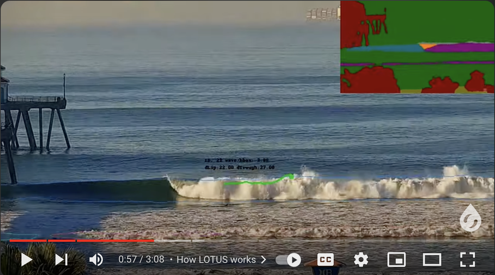
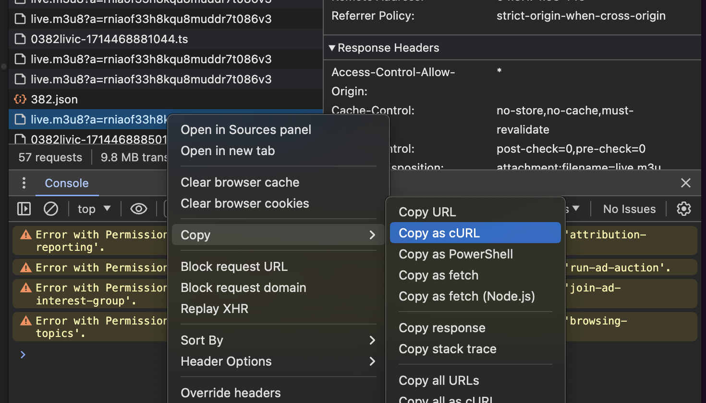
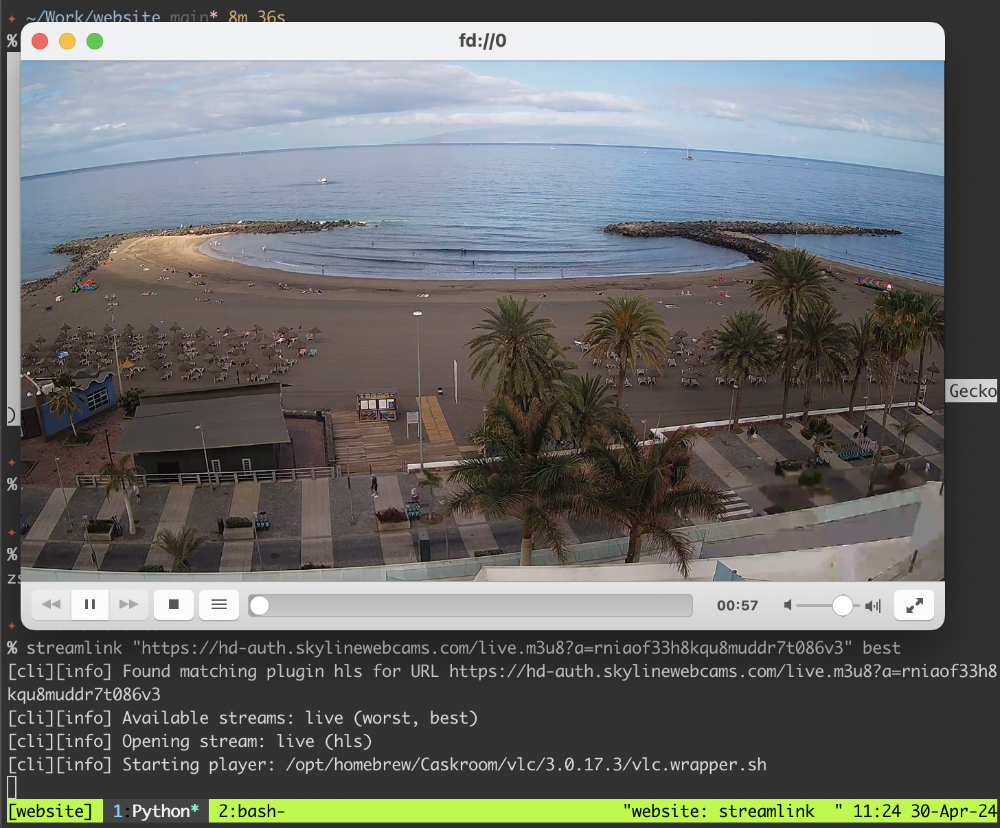

A few days ago I saw this video about [Surfline](https://www.surfline.com/)&apos;s [LOTUS Surf Forecasting System](https://www.youtube.com/watch?v=xecRZIM6Vlg). 
They have hundreds of webcams around the world, and they analyze the streams to understand and predict the quality of the waves.

[](https://www.youtube.com/watch?v=xecRZIM6Vlg)

Surfline does not seem to have any webcams where I live (Southern
Mediterranean), which is understandable, given the questionable quality of the surf. 
But the beach is still a big attraction, and there are plenty of webcams pointed at it.

I've been [ playing with computer vision
](https://github.com/jesusgollonet/opencv-clip-cutter) lately and want to give some basic wave detection a try.  The first step is capturing streams from beach webcams, but they usually appear in sites which are slow and full of ads.

[Streamlink ](https://streamlink.github.io/) 
is a great tool for that. It allows you to watch streams in VLC and provides a Python API that gives access to the stream data.

If the stream you care about is in a popular platform, like twitch or youtube
(or many others!) chances are there is [streamlink plugin](https://streamlink.github.io/plugins.html) for it. Usage in this case is as simple as 
```bash
streamlink https://www.twitch.tv/merewether_slsc best 
```

If there is no plugin, you can look for the `m3u8` file in the page source and pass it to streamlink. 

```bash
streamlink 'https://hd-auth.skylinewebcams.com/live.m3u8?a=rniaof33h8kqu8muddr7t086v3' best 
```

Some sites do have some protection against this, but it hasn't been too hard to get around it.
Streamlink allows you to pass cookies and headers to the request, so what I've done to figure out what headers were needed was to copy the curl
request from the network panel and tweak them so they have the correct streamlink format for the `--http-header` option.



In the couple of sites I tried, it has been enough to simply pass the origin
header to streamlink, so from

```bash
curl 'https://hd-auth.skylinewebcams.com/live.m3u8?a=rniaof33h8kqu8muddr7t086v3'
...
      -H 'origin: https://www.skylinewebcams.com' \
...
```

to 

```bash
streamlink --http-header 'origin=https://www.skylinewebcams.com' 'https://hd-auth.skylinewebcams.com/live.m3u8?a=rniaof33h8kqu8muddr7t086v3' best 
```




And I will leave it at that, as I just saw there might be some waves to catch
today! 🏄


