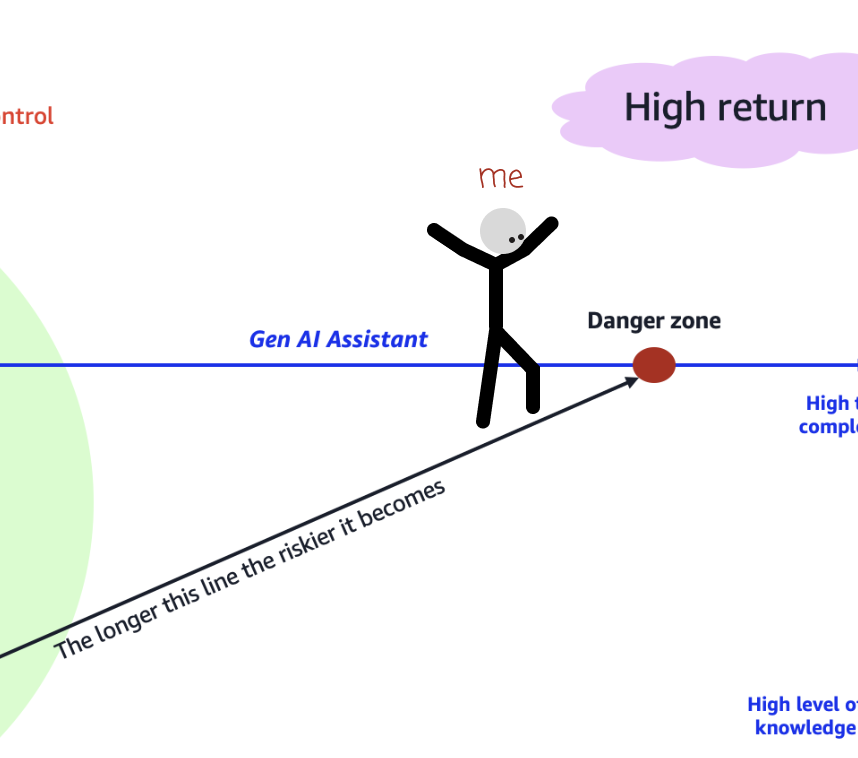

Yesterday, this [framework reflecting on where and when to adopt coding
assistants](https://it20.info/2024/5/a-framework-to-adopt-generative-ai-assistants-for-builders/) caught my attention.
The full article is worth a read, here's the graph that summarizes it:

The quick summary is that the further a given task is from your skill level, the
more risk you're taking by delegating to a coding assistant. That doesn't mean
you should not do it, just that you need to take that risk into account.

Anyway, It caught my attention because I have scars.

At the beginning of the year I started developing an app using Rust. I had 0
previous experience with the language, but I have been interested for years and,
hey, we have ChatGPT and copilot! Learning curves are a relic of the past,
right? 

During the initial weeks I was able to progress fairly quickly. Sure I sometimes
got in a loop of copy / paste from ChatGPT => editor and then compiler error message => ChatGPT, 
but I always ended up making it work... 

Until I didn't. Close to easter I was wrapping up an initial release of the project. 
There was a feature that required a small refactor using threading and then I got into the classic  loop but this time I kept spinning circles for hours, with ChatGPT suggesting progressively gnarlier looking type signatures until it gave up and got back to its initial suggestion.

The reality is that I had a barely functional understanding of concurrency and the Rust 
borrow checker, so if ChatGPT couldn't help, I was out of luck. 

I had to spend a significant portion of easter paying off the knowledge debt I had incurred, or 
in framework terms, my risk line got really long, and I got burned. 

LLMs can get you really far really fast, but you always need to keep your risk in check.

This is similar to the classic [circle of competence](https://en.wikipedia.org/wiki/Circle_of_competence) advice for investing: 

> Limit the investments you make in areas where you have little knowledge or experience.

The other takeaway I found insightful is in the 'green area' of the graph.

You need to stay relatively close to your knowledge frontier in order to apply
assistants effectively. Tasks that are right below your competence level (the boost zone) are often great to delegate, as they might be within your means but can often be tedious to do.

But the most fun area is the learning zone, where something is right above your competence level and you can use the assistant to pull you up. A tricky thing here is that it requires being aware of what your actual competence is, which
might sometimes be a fun exercise for your ego. 

Funnily enough this is exactly how I got out of my Rust rut. I kept going back
to basics until I found where I stood, then started building back up.  

P.S.: [I kept thinking about the
graph](https://x.com/jesusgollonet/status/1795473331908436133) and came to the conclusion that a single line would make it
clearer.

And [ben11kehoe had exactly the same idea.
](https://x.com/mreferre/status/1795712647905820706)

So yep, be careful out there.

