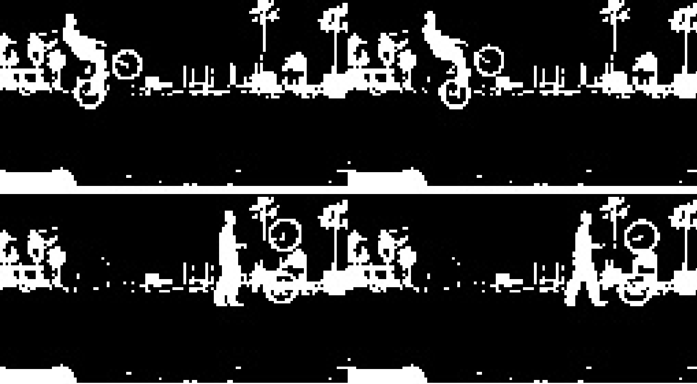

I just got confirmed for the Summer 2 batch at the Recurse Center starging in
July 1st and I'm through the moon.

I have been wanting to attend for the longest time (I have tweets from as far
back asw 2017) but always had other commitments. Back in May I decided it was
the perfect time, got my application together and after a couple of lovely
interviews (the last one was a pair programming interview which I did at 9pm
from a family resort on not much sleep after a 4 hour drive) I got in!

## What I'll be working on

I have a few projects in mind that I want to work on:
- Finishing the [opencv clip cutter](https://github.com/jesusgollonet/opencv-clip-cutter), potentially looking into posture analysis for bmx and skate tricks  
- Looking into [webcam wave analysis](https://jesusgollonet.com/posts/watching-the-surf-in-vlc-with-streamlink/)
- Finishing my [blog cli tool](https://github.com/jesusgollonet/website/tree/main/cli)

 

That said, just after getting access to the recurse platform, first thing I see
is an intro to [supercollider](https://supercollider.github.io/) (which I was
really into in early 10s) and an algorave for tomorrow, so this is going to be
tough. I'm fully open to whatever comes my way.

## Why I'm attending

There are a few reasons why I'm attending the recurse center:

### More Programming! 

In the last few years I've gotten a bit far from hands on programming. My work
has been more on the management and communication side, and when I was coding, I
was doing that more on the ops side, favoring serverless / managed solutions as
much as possible. There is nothing wrong with that approach and I will continue
to push for that, but that's closer to architecture, and it's making me lose a
building edge, which I miss.

### More Community!  

For the longest time, whenever I saw a blog post with an interesting deep dive
into some technical problem, I knew chances were high it came from a recurse
center alum. I want to hang out with those people!

### Accountability 

Related to community, having a group of people that can see what you're working
on is the best motivator to push yourself. I really want that in order to finish
some of the projects I have in mind.

### Work prospects :)

I have been working in creative digital agencies for almost all my career. I
love that work, but I have always been curious about working in a more product
focused role. The recurse center offers a great opportunity to explore that
angle. 

## Logistics

I will be joining remotely from Spain. While I know attending in person in New
York would multiply the experience, I have been working remotely and across
timezones long enough to know how to make the most of it. Kids are on summer
holidays but my wife will be taking care of them in the afternoon /
evenings so I can focus on the program ❤️.

Can't wait to get started in a week!
